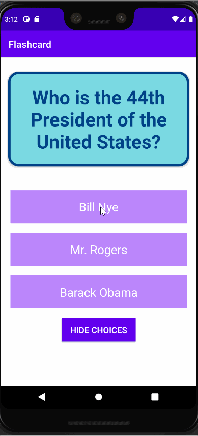

# Flashcard
This Android application was created as a part of the CodePath Intro to Mobile Development class.

## Lab 2

### App Description
Users can now change the current flashcard displayed by adding a new flashcard with its corresponding questions, answers, and choices or by editing the current card. A notification will display on the bottom of the screen with a message signaling whether the flashcard was edited or created.

### App Walk-though
`TODO://` Add the URL to your animated app walk-though `gif` in the image tag below. Make sure the gif actually renders and animates when viewing this README.
 

## Required
- [x] User can click on a ‘+’ button that takes the user to new ‘Add Card Screen’
- [x] The 'Add Card Screen' has a cancel button to take the user back to the main screen
- [x] User can enter and submit a Question and Answer through the 'Add Card Screen'
- [x] User will see the card they just created on the main screen when they press the 'Save Button'
- [x] Push your progress to GitHub!

## Optional
- [x] User can edit a card
- [x] An error message is shown if the user doesn't enter both a Question and an Answer
- [x] A notification is shown if the card was created successfully
- [x] User can also enter multiple choice answers when creating a card
- [ ] App is further styled and customized!

## Lab 1

### App Description
App displays one question with three answer choices. Correct choice lights up green, and incorrect choices show up as red. There is also the option to hide the choices and click on the question card to show the answer.

### App Walk-though
 

## Required
- [x] Create New Project in Android Studio
- [x] Add a view for the front side of the flashcard to display the question
- [x] Add a view for the back side of the flashcard to display the answer
- [x] Build in logic to show the answer side when the card is tapped
- [x] Push code to GitHub
## Optional
- [x] toggle the flashcard between the question side and the answer side
- [x] Style the question and answer side of the card to better distinguish between the two sides
- [x] Add selectable multiple choice answers beneath the card
   - [x] Change the background color of the multiple choice answers when clicked to indicate whether the question was answered correctly
- [x] Further customize and style the card
